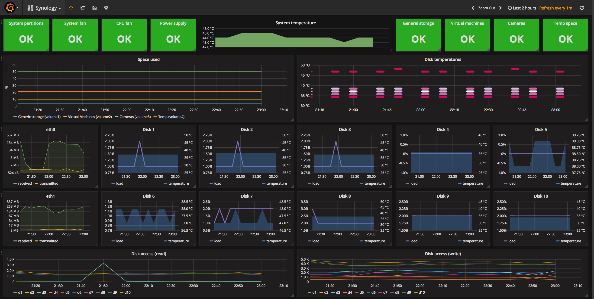
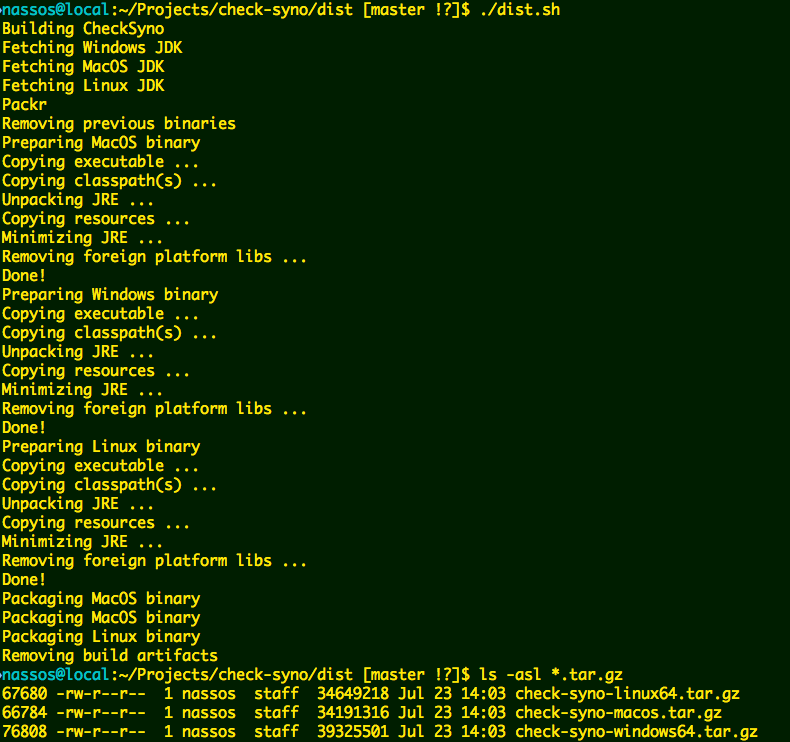
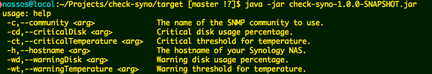
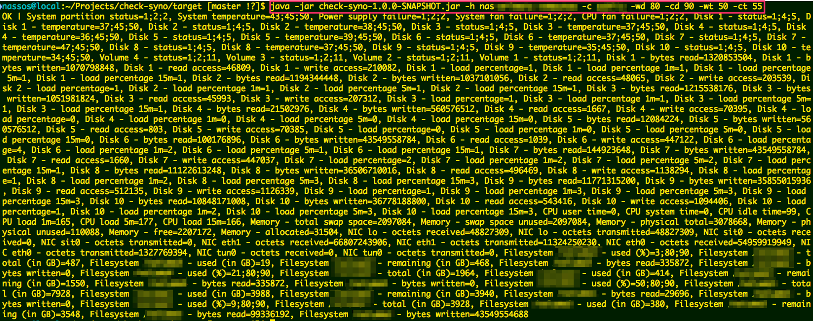
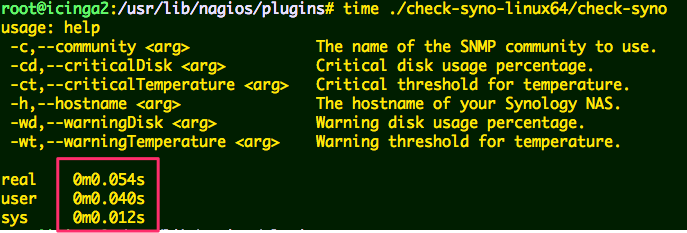

# CheckSyno - Synology monitoring plugin for Icinga (Nagios, et al)
This is a monitoring plugin following the Nagios Plugins specifications
to monitor a Synology NAS. The plugin is written in Java but is already
packed in a distributable format for you in case you do not have a JRE
installed on your server. The plugin works with a Synology in which
SNMP (v2) is enabled.

## What is monitored
### System
* System partition status
* System temperature
* Power supply status
* System fan status
* CPU fan status

### CPU
* User time
* System time
* Idle time
* Load 1 minute
* Load 5 minutes
* Load 15 minutes

### Disks & Storage
:star: Disks are automatically discovered - up to 64 disks supported
* Status
* Temperature
* Bytes read (since NAS' boot)
* Bytes written (since NAS' boot)
* Read access (since NAS' boot)
* Write access (since NAS' boot)
* Load percentage
* Load percentage 1 minutes
* Load percentage 5 minutes
* Load percentage 15 minutes

### Filesystems
:star: Filesystems are automatically discovered - up to 255 filesystems supported
* Total size
* Used size
* Remaining
* Used percentage
* Bytes read (since NAS' boot)
* Bytes written (since NAS' boot)

### Memory
* Total swap space
* Swap space unused
* Total physical memory
* Total physical memory unused
* Total memory free
* Total memory allocated

### Networking
:star: NICs are automatically discovered - up to 16 NICs supported
* Octets received (since NAS' boot)
* Octets transmitted (since NAS' boot)

### RAID
:star: RAID volumes are automatically discovered - up to 64 RAID volumes supported
* Status

## Thresholds
The following thresholds are supported:
* Temperature warning & critical threshold
* Space usage warning & critical threshold

## How to build
Go to `dist` folder and execute the `dist.sh` scirpt:

## How to run
### With Java
If you have a JRE available on your server (>= J2SE 1.7), you can use the
`check-syno-VERSION.jar` file as, e.g.: `java -jar check-syno-1.0.0.jar`

### Without Java
Extract the `*.tar.gz` file for your OS and execute directly the binary
distribution (see also below).

### Java? Java is slooooow
Not really...

